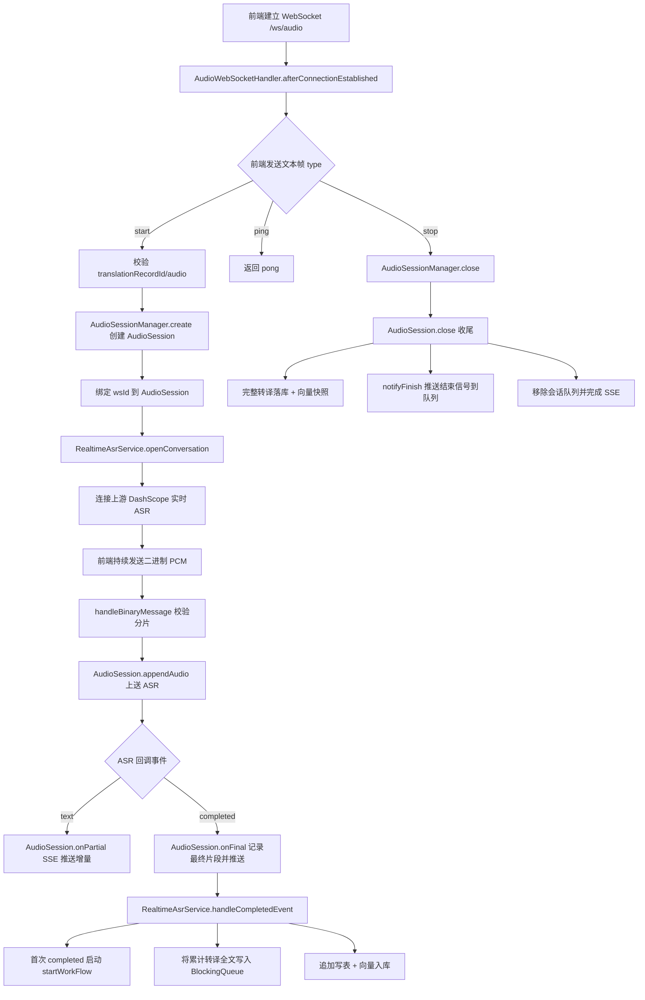
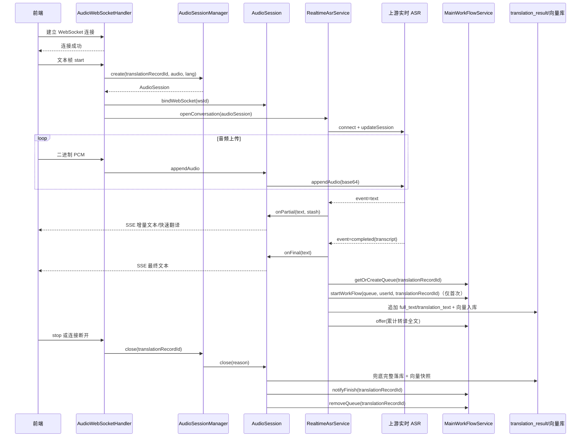
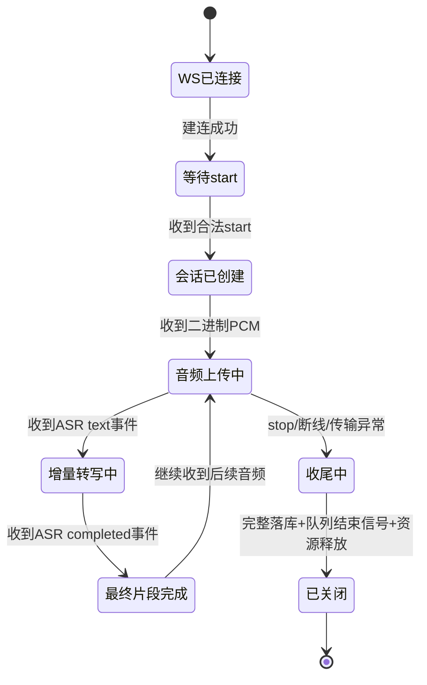

# WebSocket 建连后端流程说明

本文说明前端建立 WebSocket 连接后，后端从接入、转写、转译、工作流到收尾的完整行为。

## 1. 关键组件

- WebSocket 入口：`/ws/audio`（`WebSocketConfig` 注册）
- WebSocket 处理器：`AudioWebSocketHandler`
- 会话容器：`AudioSession`
- 会话管理器：`AudioSessionManager`
- 上游 ASR 对接：`RealtimeAsrService`
- 主工作流：`MainWorkFlowService`
- 下行推送：`AudioSseController`（`/sse/audio`）
- 持久化：
  - 普通表：`translation_result`
  - 向量库：`VectorStore`

## 2. 协议与消息

前端与后端的 WebSocket 协议约定：

- 文本帧：
  - `start`：创建会话并连接上游 ASR
  - `stop`：结束会话
  - `ping`：保活
- 二进制帧：
  - 发送 PCM 音频分片（必须在 `start` 成功后）

## 3. 总体流程图



## 4. 详细时序



## 5. 建连后的关键后端行为（按阶段）

### 5.1 连接建立阶段

- 后端仅建立 WebSocket 通道并设置二进制帧大小上限。
- 还没有业务会话，直接发音频会被拒绝（`SESSION_NOT_FOUND`）。

### 5.2 `start` 阶段

- 校验 `translationRecordId`、音频参数合法性、会话是否重复。
- 创建 `AudioSession`，并把当前 WebSocket 连接 ID 绑定到会话。
- 创建上游 ASR 会话并下发 ASR 配置（语言、采样率、输入格式）。

### 5.3 音频流阶段

- 每个二进制音频分片会做大小校验（按协商音频规格）。
- 合法分片经 `AudioSession.appendAudio` 转发到上游 ASR。

### 5.4 ASR 事件阶段

- `conversation.item.input_audio_transcription.text`
  - 走 `onPartial`，推送 SSE 增量文本。
- `conversation.item.input_audio_transcription.completed`
  - 走 `onFinal`，记录最终片段并推送 SSE 最终文本。
  - 进入 `handleCompletedEvent`：
    - 获取/创建该 `translationRecordId` 的 `BlockingQueue`
    - 首次触发时调用 `startWorkFlow(blockingQueue, userId, translationRecordId)`
    - 异步翻译并把“累计转译全文”推送到 `BlockingQueue`
    - 同时执行普通表追加与向量入库

### 5.5 会话结束阶段（`stop` / 断开 / 传输异常）

- `AudioSessionManager.close` 统一关闭会话。
- `AudioSession.close` 执行收尾：
  - 结束上游会话并短暂等待最终片段回流
  - 兜底执行“完整全文转译”写库（表 + 向量库）
  - 调用 `notifyFinish(translationRecordId)` 向队列推送结束信号，解除工作流阻塞等待
  - 调用 `removeQueue(translationRecordId)` 释放队列

## 6. BlockingQueue 与工作流约定

`MainWorkFlowService` 约定如下：

- 每个 `translationRecordId` 一个独立 `BlockingQueue<String>`
- 队列消息内容：
  - 普通消息：转译累计全文
  - 结束消息：`FINISH_SIGNAL`
- `startWorkFlow` 只需要三个参数：
  - `BlockingQueue<String> blockingQueue`
  - `String userId`
  - `String translationRecordId`

工作流内部如何消费队列并实现后续节点处理，由图编排内部决定；后端在当前层只负责可靠传递。

## 7. 异常分支

- 非法 JSON / 缺失 `type` / 未知 `type`：直接返回 WebSocket 错误文本帧
- 未先 `start` 就发送音频：`SESSION_NOT_FOUND`
- 分片大小不合法：`INVALID_MESSAGE`
- ASR 错误事件：通过 SSE 下发 `INTERNAL_ERROR`
- 会话重复创建：`SESSION_ALREADY_ACTIVE`

## 8. 前端消息示例

### 8.1 `start` 文本帧

```json
{
  "type": "start",
  "translationRecordId": "sess_20260313_001",
  "audio": {
    "codec": "pcm_s16le",
    "sampleRate": 16000,
    "channels": 1,
    "chunkMs": 20
  },
  "sourceLang": "zh",
  "targetLang": "en"
}
```

### 8.2 `ping` 文本帧

```json
{
  "type": "ping",
  "ts": 1760000000000
}
```

### 8.3 `stop` 文本帧

```json
{
  "type": "stop",
  "translationRecordId": "sess_20260313_001"
}
```

### 8.4 音频二进制帧

- 内容：PCM 原始字节（与 `start.audio` 声明一致）
- 发送顺序：必须在 `start` 成功后
- 分片大小：必须符合后端 `AudioSpec.bytesPerChunk()` 校验规则

## 9. 线程与并发模型

### 9.1 WebSocket 线程

- `AudioWebSocketHandler` 在 WebSocket 处理线程中执行：
  - 文本帧解析和控制命令路由
  - 二进制分片校验和转发

### 9.2 异步业务线程

- `llmExecutorService` 用于异步执行：
  - 每个 `completed` 的翻译
  - 数据库追加
  - 向量入库
  - 首次触发的 `startWorkFlow`

### 9.3 会话并发保护

- `AudioSession.close` 使用原子标志保证幂等关闭。
- `RealtimeAsrService` 使用 `workflowStartedMap` 保证同一会话只启动一次工作流。
- `MainWorkFlowService` 使用 `translationRecordId -> BlockingQueue` 映射隔离不同会话。

## 10. 会话状态机



## 11. `completed` 事件内部执行顺序（当前实现）

单次 `conversation.item.input_audio_transcription.completed` 到来后：

1. `AudioSession.onFinal(text)`  
2. `RealtimeAsrService.handleCompletedEvent(audioSession, text)`  
3. 获取该会话 `BlockingQueue`  
4. 若该会话工作流未启动：调用 `startWorkFlow(queue, userId, translationRecordId)`（异步）  
5. 异步翻译当前片段  
6. 更新普通表 `translation_result`（追加 `full_text` / `translation_text`）  
7. 将“转译累计全文”推送到 `BlockingQueue`  
8. 写入向量库（本次片段与上次片段拼接文本）  

## 12. 会话结束时的保障动作

会话结束（`stop`、WS 断开、传输异常）统一进入 `AudioSession.close`：

1. 结束上游 ASR 会话  
2. 等待短缓冲，尽量接收最后转写片段  
3. 执行完整兜底落库（完整原文 + 完整译文）  
4. 写入完整向量快照  
5. `notifyFinish(translationRecordId)`，向工作流队列推送结束信号  
6. `removeQueue(translationRecordId)`，释放会话队列  
7. 结束 SSE emitter  

## 13. 前端联调检查清单

- WebSocket 建连成功后，是否先发 `start` 再发音频
- `translationRecordId` 在同一次会话内是否保持一致
- 音频分片大小是否与 `AudioSpec` 对齐
- 是否建立 SSE 订阅以接收 `partial/final/translation/error`
- 结束时是否主动发送 `stop`
- 若异常断线，是否允许后端自动收尾并在下次查询中看到完整落库结果

## 14. 一句话总结

前端建立 WebSocket 后，后端会创建并维护会话状态，把音频实时转写与转译，同时将“转译累计全文”通过会话级 `BlockingQueue` 输送给主工作流，并在会话结束时通过结束信号解除阻塞、进入后续流程并完成兜底持久化。

